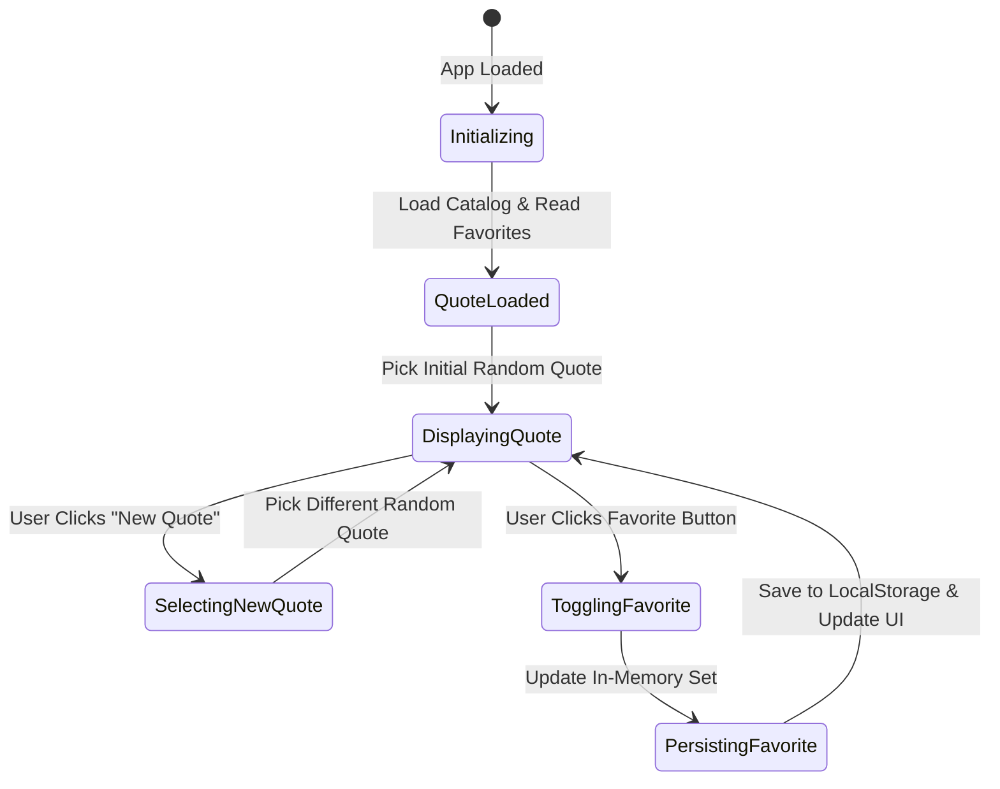

# Data Model: Quote of the Day

**Feature**: Quote of the Day
**Branch**: `001-quote-of-the-day`
**Date**: 2026-10-07

This document defines the core data entities, schemas, validation rules, and state lifecycle for the Quote of the Day application.

---

## 1. Entities & Schemas

### 1.1 Quote Entity

Represents a single curated quotation.

```typescript
interface Quote {
  id: string;      // Unique immutable string identifier (e.g., "q-001")
  text: string;    // The actual quotation body text
  author: string;  // The speaker or author attribution (e.g., "Maya Angelou")
}
```

#### Validation Rules:
- `id`: Non-empty string, ASCII alphanumeric and hyphen characters only. Unique across the catalog.
- `text`: Non-empty string, trimmed of excessive whitespace.
- `author`: Non-empty string. If unknown in the source data, normalized to `"Anonymous"`.

---

### 1.2 Favorite Collection Entity

Represents the user's saved preferences for favorited quotes.

```typescript
// In-Memory Representation
type FavoriteSet = Set<string>; // Set of Quote IDs

// Serialized Storage Representation (JSON string in localStorage)
type SerializedFavorites = string[]; // Array of Quote IDs, e.g., ["q-001", "q-007"]
```

#### Validation & Sanitization Rules:
- When deserializing from `localStorage`:
  - Input MUST be valid JSON array of strings.
  - Non-string items or malformed elements MUST be filtered out.
  - Duplicate IDs MUST be deduplicated.
  - If JSON parsing fails or payload is not an array, reset to an empty set (`[]`) and log a diagnostic warning.

---

### 1.3 Application State Entity

Represents the live state of the client application.

```typescript
interface AppState {
  catalog: Quote[];             // Complete loaded catalog of available quotes
  currentQuote: Quote | null;   // The quote currently presented on screen
  previousQuoteId: string | null; // The ID of the quote shown immediately prior
  favoriteIds: Set<string>;     // Set of quote IDs marked as favorites
  storageAvailable: boolean;    // Whether persistent browser storage is functional
}
```

---

## 2. State Machine & Lifecycle Transitions



### Transition Specifications:

1. **`INITIALIZE`**:
   - Input: Catalog list, access to storage adapter.
   - Action: Load quote catalog; initialize `FavoriteSet` from storage (or fallback empty set if unavailable).
   - Next State: `SELECT_INITIAL_QUOTE`.

2. **`SELECT_INITIAL_QUOTE`**:
   - Action: Select index `floor(random() * catalog.length)`.
   - Update: `currentQuote = catalog[index]`, `previousQuoteId = currentQuote.id`.
   - Next State: `DISPLAY_QUOTE`.

3. **`SELECT_NEW_QUOTE`**:
   - Pre-condition: Catalog has at least 1 quote.
   - Logic:
     - If `catalog.length === 1`: return `catalog[0]`.
     - Else: Candidates = `catalog.filter(q => q.id !== previousQuoteId)`. Pick random candidate.
   - Update: `currentQuote = candidate`, `previousQuoteId = candidate.id`.
   - Next State: `DISPLAY_QUOTE`.

4. **`TOGGLE_FAVORITE`**:
   - Pre-condition: `currentQuote !== null`.
   - Logic:
     - If `favoriteIds.has(currentQuote.id)`: remove `currentQuote.id`. (State: Unfavorited)
     - Else: add `currentQuote.id`. (State: Favorited)
   - Persistence: Serialize `Array.from(favoriteIds)` to `localStorage`.
   - UI: Update aria attributes and visual favorite icon.
